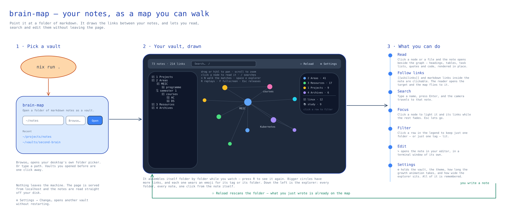

# brain-map

Turns a folder of markdown notes into an interactive knowledge graph. Point it at a
vault, watch it assemble itself node by node, then walk it.



## Install it

```sh
yay -S brain-map-bin                          # Arch, from the AUR
nix profile install github:joaopinto15/brain-map   # anywhere Nix runs
```

Or run it without installing:

```sh
nix run github:joaopinto15/brain-map           # pick the vault in the window
nix run github:joaopinto15/brain-map -- ~/notes   # or name it and skip the picker
```

Linux only for now — the window opens on Wayland or X11, and there is no Windows or
macOS build to package.

## Run it

```sh
nix run .              # pick the vault in the window
nix run . -- ~/notes   # or name it and skip the picker
```

A git URL opens too, on the command line and in the picker:

```sh
nix run . -- https://github.com/you/notes
```

It is cloned under `$XDG_CACHE_HOME/brain-map/vaults` and opened from there; opening the
same URL again fast-forwards the clone, and an offline machine still opens the last one.
A vault on Google Drive or OneDrive is a local folder once their client syncs it, so
those need nothing here.

brain-map is one window and one process. There is no browser, no server and no port: it
reads the vault off the disk and draws it, so the notes never leave the machine and
nothing is listening while it does.

It works on an Obsidian vault, an AI Workshop OS vault, or a plain folder of `.md`
files. Edges come from `[[wikilinks]]` and relative markdown links. A vault with no
links still draws as a tree: vault → folder → note.

## Keys

**drag** or **hjkl** pans, **scroll** zooms, **click** a node to read it. **/** focuses
the search box and **n** and **N** walk the matches. **R** replays the growth animation,
**F** gives the note the whole window, **space e** hides the explorer, **Esc** releases
whatever is held. Everything configurable lives behind **⚙ Settings**: vault, theme,
growth budget, explorer width, and whether the explorer shows.

## Groups and tags

A note has exactly one *group*: its top-level folder, or its role in an AI Workshop OS
vault. The group decides the note's colour, its size and when it appears in the growth
animation, so the groups partition the vault and their counts add up to it. *Tags* come
from the `tags:` field in the frontmatter. A note can carry several or none, they cut
across folders. Filtering by a group shows one region of
the map. Filtering by a tag shows a thread running through several.

`title`, `tags` and `icon` are the only frontmatter keys read. `icon:` is one emoji and
it is the only thing that puts one on a note — nothing is inferred from a note's name, its
folder or its tags, so a note without the key draws as a plain disc.

```yaml
---
title: Sistemas Gráficos Interativos
icon: 🎨
tags: [meic, feup, graphics]
---
```

 A `type:` is read past, so the
concepts of an
[Open Knowledge Format](https://github.com/GoogleCloudPlatform/knowledge-catalog/blob/main/okf/SPEC.md)
bundle group by the directory they sit in like any other note, and bundle-absolute links
(`[orders](/tables/orders.md)`) resolve alongside relative ones.

Skipped while scanning: `.git`, `.obsidian`, `node_modules`, `.brain-map`,
`__pycache__`, `.venv`, `venv`, `dist`, `build`, `.next`, `.cache`, and any
dot-directory.

## Development

```sh
nix develop . --command cargo test --workspace   # every crate
nix develop . --command cargo run -- ~/notes     # the window, on a vault
```

It is Rust the whole way down, and no JavaScript at all — there is no web page left to
put any in. Three crates: this one scans the vault, `crates/app` is the window, and
`crates/model` is the graph they meet on. The window is `eframe`, and the graph, the note
renderer, the folder tree and the chrome are all drawn by hand against it.

The icons are the real thing rather than outlines: egui cannot draw a colour bitmap font,
so `emoji.rs` reads the PNG for a glyph out of Noto Color Emoji itself and hands egui a
texture. Install `noto-fonts-emoji` — the Nix package ships its own copy — or set
`$BRAIN_MAP_EMOJI_FONT` at a font of your own.

The split the browser drew is still there, as a trait. `Source` in `crates/model` is the
six things the window may ask for — scan the vault, fingerprint it, read a note, open one
in `$EDITOR`, show a folder dialog, and turn a typed path or URL into a vault — and it is
implemented once, in `src/main.rs`. Those were six HTTP routes when the page ran in a
browser. Nothing on the window's side of that trait can touch the disk, which is why most
of `crates/app` is tested with a plain `cargo test` and no window: the force simulation,
the note renderer, link resolution, the keymap, the legend filter and the theme table all
run on the host.

The words the project uses are in [CONTEXT.md](CONTEXT.md), and the decisions that would
otherwise be surprising are in [docs/adr](docs/adr).

The vault is followed by polling, not by watching: once every two seconds the window asks
for one hash over every note's path, length and modified time, and reloads when it moves —
keeping the note that was open. There is no notifier in the standard library and a stat
walk is not worth a dependency.

The diagram above is `docs/overview.excalidraw`, drawn in
[Excalidraw](https://excalidraw.com); `docs/overview.svg` is its export.

## License

MIT — see [LICENSE](LICENSE).
