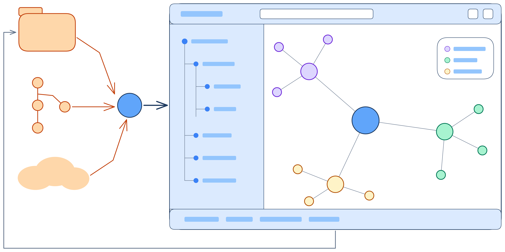

# How brain-map is put together

One window, one process. It reads a folder off the disk and draws it. There is no
browser, no server, no port, and no JavaScript anywhere, so your notes never leave the
machine and nothing is listening while you read them.

## Three crates and one seam

The root crate reads the disk and nothing else. `crates/app` is the window, and it may
not touch the filesystem at all. `crates/model` holds the graph they meet on, and carries
no dependency of any kind.

The seam between them is the `Source` trait in `crates/model`, implemented once in
`src/main.rs`. It is everything the window may ask of the machine: scan the vault, hash
it, read a note, hand one to `$EDITOR`, show a folder dialog, list the drives, and turn
what someone typed into a vault. Six of those were HTTP routes back when the graph ran in
a browser. That history is in
[ADR 0001](adr/0001-a-window-of-our-own-instead-of-a-browser.md).

Because the window cannot reach the disk, most of it runs under a plain `cargo test` with
no window open: the force simulation, the markdown parser, link resolution, the folder
tree, the keymap, the legend filter, and the theme table.

## Drawn by hand

The window is [eframe](https://github.com/emilk/egui). The graph, the note, the folder
tree, and the panels are all painted directly against it. The layout is a port of
d3-force: link, charge, collide, centre, gravity, with alpha cooling and a seeded random
number generator, so the same vault settles the same way every run.

What the collide pass keeps apart is names, not circles. A label is wide and short, so
the simulation counts vertical distance more heavily than horizontal, and nodes stack
above one another rather than sitting side by side with their names overlapping.

## Icons are pictures

egui rasterises font outlines and cannot draw a colour bitmap font, so an emoji drawn as
text comes out a grey outline however good the font is. `emoji.rs` reads the PNG for a
glyph straight out of Noto Color Emoji and hands egui a texture, cached one per emoji.

Install `noto-fonts-emoji`, or point `$BRAIN_MAP_EMOJI_FONT` at a font of your own. The
Nix package ships its own copy.

## Following the vault by polling

Every two seconds the window asks for one hash over every note's path, length, and
modified time, and reloads when it moves. A reload keeps the note you had open and skips
the growth animation.

Polling, rather than watching, because the standard library has no file notifier and a
stat walk is not worth a dependency.

## Long jobs run off the frame thread

A git clone and the desktop's folder dialog take as long as they take. Both run on a
worker thread, because a frame that waits on one is a window the compositor reports as
not responding.

## The words, and the decisions

The vocabulary the project uses for everything above is in [CONTEXT.md](../CONTEXT.md).
Decisions that would otherwise be surprising are written up in [adr/](adr).

## Working on it

The toolchain, the branch names, the checks and how a release is cut are in
[CONTRIBUTING.md](../CONTRIBUTING.md).

The diagrams here are `architecture.excalidraw` and `structure.excalidraw`, drawn in
[Excalidraw](https://excalidraw.com). `overview.excalidraw` and its `overview.svg` export
are the picture on the README.
